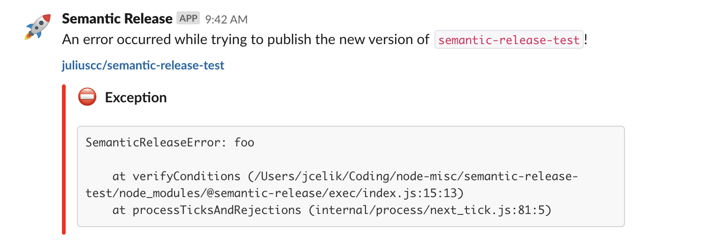

# semantic-release-slack-bot

[**semantic-release**](https://github.com/semantic-release/semantic-release) plugin to get release notifications on [slack](https://slack.com/) from a slack bot

[](https://www.npmjs.com/package/semantic-release-slack-bot)
[](https://www.npmjs.com/package/semantic-release-slack-bot)
[](https://circleci.com/gh/juliuscc/semantic-release-slack-bot)
[](https://github.com/juliuscc/semantic-release-slack-bot/blob/master/LICENSE)
[](https://slack.com/oauth/authorize?client_id=605439709265.611687593109&scope=incoming-webhook)

| Step      | Description                                         |
| --------- | --------------------------------------------------- |
| `success` | Send a slack message to notify of a new release.    |
| `fail`    | Send a slack message to notify of a failed release. |

## Install

Add the plugin to your npm-project:

```bash
$ npm install semantic-release-slack-bot -D
```

The corresponding slack app has be installed in you slack workspace as well. Follow the instructions under [configuration](#configuration) for more information.

## Usage

The plugin can be configured in the [**semantic-release** configuration file](https://github.com/semantic-release/semantic-release/blob/master/docs/usage/configuration.md#configuration):

```json
{
	"plugins": [
		"@semantic-release/commit-analyzer",
		"@semantic-release/release-notes-generator",
		[
			"semantic-release-slack-bot",
			{
				"notifyOnSuccess": false,
				"notifyOnFail": true
			}
		]
	]
}
```

With this example:

-   Slack notifications are skipped on a succesfull release
-   Slack notifications are sent on a failed release

## Screenshots




## Configuration

### Slack app installation

The plugin uses a slack webhook which you get by adding the slack app to your slack workspace. Register the app using the button below or [this link](https://slack.com/oauth/authorize?client_id=605439709265.611687593109&scope=incoming-webhook).

<a href="https://slack.com/oauth/authorize?client_id=605439709265.611687593109&scope=incoming-webhook"></a>

### Slack app authentication

Installing the app will yield you with a webhook that the app uses to publish updates to your selected chanel. The Slack webhook authentication link is **required and needs to be kept a secret**. It should be defined in the [environment variables](#environment-variables).

### Environment variables

The `SLACK_WEBHOOK` variable has to be defined in the environment where you will be running semantic release. This can be done by exporting it in bash or in the user interface of you CI provider. Obtain this token by installing the slack app according to [slack app installation](#slack-app-installation).

| Variable        | Description                                         |
| --------------- | --------------------------------------------------- |
| `SLACK_WEBHOOK` | Slack webhook created when adding app to workspace. |

### Options

| Option            | Description                                                                                                                   | Default |
| ----------------- | ----------------------------------------------------------------------------------------------------------------------------- | ------- |
| `notifyOnSuccess` | Determines if a succesfull release should trigger a slack message to be sent. If `false` this plugin does nothing on success. | false   |
| `notifyOnFail`    | Determines if a failed release should trigger a slack message to be sent. If `false` this plugin does nothing on fail.        | false   |
